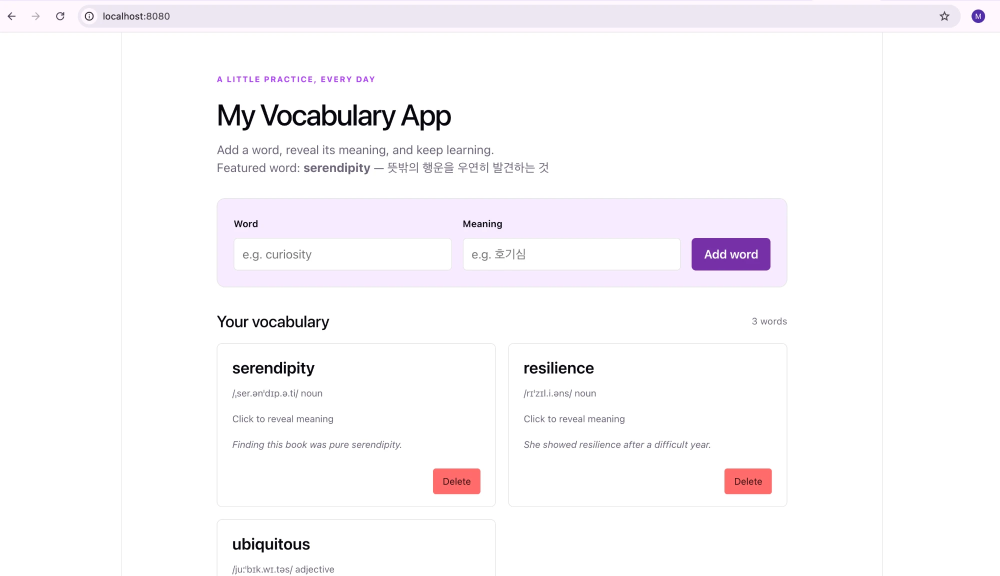

# My Vocabulary App — 3주차: 빌드와 웹서버

GDGoC KU FE 스터디 3주차 과제입니다. 2주차에 만든 단어장 앱을 `npm run build` 로 빌드하고,
Docker로 띄운 **nginx** 위에 올려 `http://localhost:8080` 으로 접속할 수 있게 만들었습니다.



## 강의에서 다룬 웹서버의 2가지 역할

### 1. 정적 서빙 (Static Serving) — 파일을 돌려준다

nginx는 **요청받은 URL 경로를 자기가 맡은 폴더(root) 안의 파일 경로로 바꿔서 그 파일을 돌려줍니다.**
이 프로젝트에서는 root 자리에 빌드 결과물인 `dist/` 를 꽂았습니다.

```
GET /                     →  dist/index.html
GET /assets/index-xxx.js  →  dist/assets/index-xxx.js
GET /about                →  dist/about (없음) → try_files 로 index.html
```

**나의 이해**

- 처음에 `dist/index.html` 을 더블클릭했을 때 흰 화면이 떠서 이상했는데, 주소창이 `file://` 이었습니다.
  빌드된 HTML은 `/assets/...js` 처럼 **서버 주소를 기준으로** 파일을 찾는데, `file://` 로 열면 그 경로가
  내 컴퓨터 디스크의 맨 위를 가리켜서 JS를 못 찾습니다. 그래서 `http://` 로 파일을 건네주는 웹서버(nginx)가 필요하다는 것을 알게 됐습니다.
- `npm run build` 는 서버를 띄우는 게 아니라 **파일만 만드는 것**이고, 그 파일을 사람들에게 계속 나눠주는 게 웹서버의 역할입니다.
- React 앱에는 `/about` 이라는 실제 파일이 없어서, 그 주소에서 새로고침하면 nginx가 404를 줍니다.
  `try_files $uri $uri/ /index.html;` 로 **파일이 없으면 index.html 을 주도록** 바꾸면, 화면은 React가 알아서 그려줍니다.

### 2. 리버스 프록시 (Reverse Proxy) — 대신 전달한다

특정 경로(`/api/`)의 요청은 파일에서 찾지 않고, **뒤에 있는 다른 서버(mini-api)로 대신 전달**합니다.

```nginx
location /api/ {
    proxy_pass http://mini-api:3001;   # 끝에 / 를 붙이지 않아야 /api 경로가 유지됨
}
```

```
브라우저 ── GET /api/words ──▶ nginx :8080 ── proxy_pass ──▶ mini-api :3001
        ◀──────── JSON ────────            ◀──────── JSON ────────
```

**나의 이해**

- 앱은 `localhost:8080`, API는 `localhost:3001` 에 있습니다. **포트가 다르면 브라우저는 다른 사이트로 보기 때문에**,
  API가 허락 헤더를 안 보내면 브라우저가 응답을 막습니다. 이게 CORS 에러입니다.
  서버는 정상적으로 응답했는데 **브라우저가 막은 것**이라서 `curl` 로는 잘 된다는 점이 신기했습니다.
- nginx가 `/api/` 로 오는 요청을 뒤에서 mini-api로 **대신 전달**해 주면, 브라우저 입장에서는 화면도 API도
  전부 `localhost:8080` 한 곳입니다. 그래서 CORS 문제가 아예 생기지 않습니다. API 코드는 하나도 고치지 않았습니다.
- 2주차에 `vite.config.js` 의 proxy가 개발할 때 해주던 일을, 배포할 때는 nginx가 해준다는 것을 이해했습니다.
- `.env` 의 `VITE_` 값은 빌드할 때 JS 파일 안에 글자로 박히기 때문에, 값을 바꾸면 꼭 다시 빌드해야 합니다.

## 실행 방법

사전 준비: Node 20+, Docker Desktop 실행, [스터디 자료 repo](https://github.com/Seungje-Lee/GDGoC-KU-FE-Study-Materials) 의 `mini-api/`

```sh
npm install
cp .env.example .env          # VITE_API_URL= (비워둠)
npm run build                 # dist/ 생성

docker network create study-net

# mini-api 컨테이너 (컨테이너 이름이 곧 proxy_pass 의 호스트 이름)
cd <스터디자료>/mini-api
docker build -t mini-api .
docker run -d --rm --network study-net --name mini-api mini-api
cd -

# nginx 컨테이너 — dist/ 와 3단계 설정을 마운트
docker run -d --rm -p 8080:80 --network study-net \
  -v "$(pwd)/dist:/usr/share/nginx/html:ro" \
  -v "$(pwd)/nginx-proxy.conf:/etc/nginx/conf.d/default.conf:ro" \
  --name study-web nginx:alpine
```

→ http://localhost:8080

```sh
curl -I http://localhost:8080/about      # 200 (SPA fallback)
curl http://localhost:8080/api/words     # 단어 JSON (프록시)
docker logs mini-api                     # 주소창엔 3001이 없는데 요청이 찍힘

docker stop study-web mini-api && docker network rm study-net   # 정리
```

## nginx 설정 파일 (누적 관계)

| 단계 | 파일 | 추가되는 것 | 결과 |
|---|---|---|---|
| 1 | `nginx.conf` | 정적 서빙만 | `/about` 새로고침 시 404 |
| 2 | `nginx-spa.conf` | SPA fallback + 캐시 헤더 | 404 해결, API 호출은 CORS 에러 |
| 3 | `nginx-proxy.conf` | `/api/` 리버스 프록시 | CORS 에러도 사라짐 |

## 3주차에서 바뀐 파일

- `.env.example` — `VITE_API_URL` 견본 (`.env` 는 커밋하지 않음)
- `src/components/RecommendedWords.jsx` — mini-api 에서 추천 단어 목록을 가져오는 컴포넌트
- `src/App.jsx` — `API_BASE` 를 환경변수에서 읽도록 변경, `<RecommendedWords />` 추가
- `nginx.conf`, `nginx-spa.conf`, `nginx-proxy.conf`

---

## (2주차) 앱 구조와 개념

A beginner-friendly React vocabulary exercise using the existing Vite project.

## Run locally

```sh
cd /Users/sujam/my-project/my-vocabulary
npm install
npm run dev
```

Open the local URL printed by Vite (usually http://localhost:5173).

```sh
npm run lint
npm run build
npm run preview
```

`lint` checks the code, `build` creates the production files in `dist`, and
`preview` serves that build locally.

## Files and concepts

- `src/App.jsx` owns the vocabulary list in state and provides add/delete functions.
- `src/components/WordCard.jsx` is a reusable card. Each instance has its own
  `useState` value to remember whether its meaning is visible. Click its main
  area, or focus it and press Enter/Space, to show or hide the meaning.
- `src/components/WordList.jsx` uses `.map()` to turn each vocabulary object into
  a card. `key={item.id}` gives React a stable identity for each card, so deleting
  one does not mix up the other cards' reveal states.
- `src/components/AddWordForm.jsx` stores both input values in state. These are
  controlled inputs: `value` comes from state and `onChange` updates that state.
  `preventDefault()` stops submission from refreshing the page. The form trims
  input, rejects empty values, and clears both inputs after a successful addition.
- `src/data/words.js` contains the initial vocabulary. Every item has `id`, `word`,
  `meaning`, `pronunciation`, `partOfSpeech`, and `example`. Added words have empty
  strings for the three optional details, which the card leaves hidden.
- `src/index.css` keeps the original theme and adds responsive form/card styles.

A **component** is a reusable piece of the interface, written as a function that
returns JSX. **Props** are values or functions passed from a parent component to
a child, such as a vocabulary item or `onDelete`. **State** is a component's
memory; updating it tells React to update the screen.

**Conditional rendering** chooses what to display. `revealed` selects the meaning
or the hint. `words.length > 0` selects the card list or `단어를 추가해보세요`.
That explicit Boolean comparison avoids accidentally displaying `0` when empty.

**Immutable deletion** means making a new array instead of changing the existing
one. `filter()` returns all items except the deleted ID, and `setWords` stores the
new array. Adding uses `[...currentWords, newWord]` to create a new array too.
New cards receive IDs from `crypto.randomUUID()` once when added.

Changes are stored in memory for this session. Refreshing restores the initial
three words; no backend, API, or persistence is included.

## Manual browser checks

1. Reveal one card; the other meanings should stay hidden. Click again to hide it.
2. Add a word and meaning; a new card should appear and both fields should clear.
3. Try empty fields and whitespace-only values; no card should be added.
4. Delete a card; the other cards should keep their reveal state.
5. Delete every card; the exact Korean empty-state message should appear, with no
   stray `0`. Add a word again to restore the list.
6. Use the Tab key and Enter/Space to operate the form and cards.
7. Check a narrow mobile viewport and inspect the browser console for errors or
   React key warnings.
